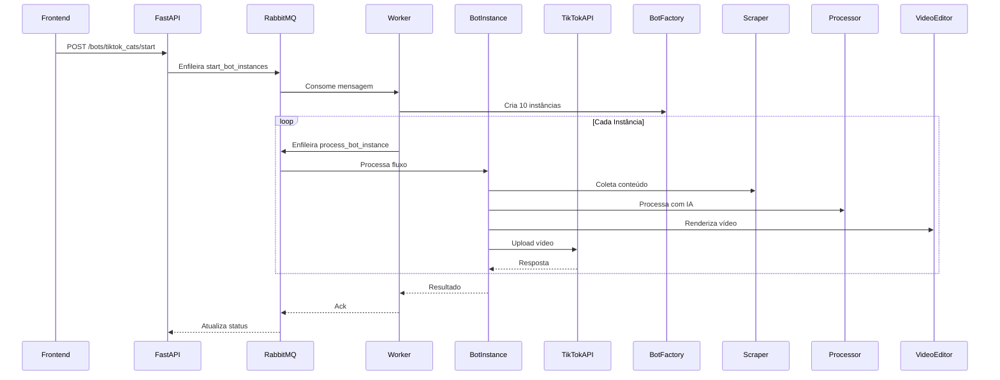

### **Arquitetura Detalhada**
```
📦
├── 📂 app
│   ├── 📂 api
│   │   ├── 📂 endpoints
│   │   │   ├── 📜 bots.py          # FastAPI endpoints
│   │   │   └── 📜 __init__.py
│   │   └── 📜 __init__.py
│   │
│   ├── 📂 core
│   │   ├── 📂 apis                 # Integrações com APIs externas
│   │   │   ├── 📜 deepseek.py
│   │   │   ├── 📜 google.py
│   │   │   ├── 📜 pexels.py
│   │   │   ├── 📜 tiktok.py
│   │   │   └── 📜 __init__.py
│   │   │
│   │   ├── 📂 assets              # Recursos de mídia
│   │   │   ├── 📂 audios
│   │   │   │   ├── 📜 notify.mp3
│   │   │   │   ├── 📜 tic-tac.mp3
│   │   │   │   └── 📜 __init__.py
│   │   │   ├── 📂 images
│   │   │   │   ├── 📜 wyr-background.png
│   │   │   │   ├── 📜 wyr-profile-pic.jpeg
│   │   │   │   └── 📜 __init__.py
│   │   │   └── 📂 music
│   │   │       ├── 📜 solitude.mp3
│   │   │       └── 📜 __init__.py
│   │   │
│   │   ├── 📂 bots
│   │   │   ├── 📂 base             # Classes abstratas
│   │   │   │   ├── 📜 bot.py       # BotBase (ABC)
│   │   │   │   └── 📜 __init__.py
│   │   │   │
│   │   │   ├── 📂 factories        # Factory Pattern
│   │   │   │   ├── 📜 bot_factory.py
│   │   │   │   └── 📜 __init__.py
│   │   │   │
│   │   │   ├── 📂 implementations # Implementações concretas
│   │   │   │   ├── 📂 choices_bot
│   │   │   │   │   ├── 📂 strategies  # Strategy Pattern
│   │   │   │   │   │   ├── 📜 editing.py
│   │   │   │   │   │   ├── 📜 scraping.py
│   │   │   │   │   │   ├── 📜 uploading.py
│   │   │   │   │   │   └── 📜 __init__.py
│   │   │   │   │   ├── 📜 bot.py   # ChoicesBot(BotBase)
│   │   │   │   │   └── 📜 __init__.py
│   │   │   │   └── 📜 __init__.py
│   │   │   │
│   │   │   └── 📂 processing       # Fluxo principal
│   │   │       ├── 📜 editor.py
│   │   │       ├── 📜 scraper.py
│   │   │       ├── 📜 uploader.py
│   │   │       └── 📜 __init__.py
│   │   │
│   │   └── 📜 __init__.py
│   │
│   ├── 📂 models
│   │   └── 📜 schemas.py           # Modelos Pydantic
│   │
│   ├── 📂 workers
│   │   ├── 📜 rabbitmq.py          # Configuração RabbitMQ
│   │   ├── 📜 tasks.py             # Tarefas assíncronas
│   │   └── 📜 __init__.py
│   │
│   ├── 📜 config.py                # Configurações do app
│   ├── 📜 main.py                  # Setup FastAPI
│   └── 📜 __init__.py
│
├── 📂 docker
│   ├── 📜 Dockerfile.api           # Configuração da API
│   └── 📜 Dockerfile.worker        # Configuração dos workers
│
├── 📂 environment
│   ├── 📜 implementation.env
│   └── 📜 template.env
│
├── 📜 docker-compose.yml
├── 📜 requirements.txt
└── 📜 README.md
```

### **Fluxo de Dados Detalhado**

