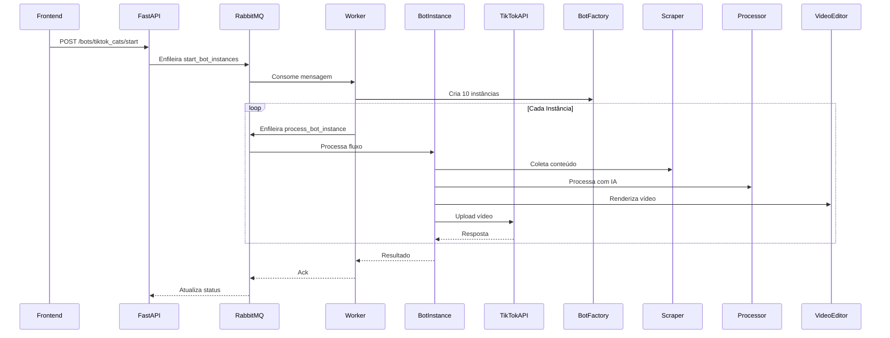

### **Arquitetura Detalhada**
```
📦 backend
├── 📂 app
│   ├── 📂 api
│   │   └── 📂 endpoints
│   │       └── 📜 bots.py          # Endpoints FastAPI
│   │
│   ├── 📂 core
│   │   ├── 📂 bots                 # Lógica principal dos bots
│   │   │   ├── 📂 base             # Classes abstratas
│   │   │   │   └── 📜 bot.py       # BotBase (ABC)
│   │   │   │
│   │   │   ├── 📂 factories        # Factory Pattern
│   │   │   │   └── 📜 bot_factory.py
│   │   │   │
│   │   │   ├── 📂 strategies       # Strategy Pattern
│   │   │   │   ├── 📜 scraping_strategy.py
│   │   │   │   ├── 📜 processing_strategy.py
│   │   │   │   ├── 📜 editing_strategy.py
│   │   │   │   └── 📜 upload_strategy.py
│   │   │   │
│   │   │   └── 📂 implementations  # Implementações concretas
│   │   │       └── 📂 first_bot
│   │   │           ├── 📜 bot.py   # FirstBot(BotBase)
│   │   │           └── 📜 config.py
│   │   │
│   │   └── 📂 processing           # Fluxo principal
│   │       ├── 📜 scraper.py
│   │       ├── 📜 processor.py
│   │       ├── 📜 editor.py
│   │       └── 📜 uploader.py
│   │
│   ├── 📂 models
│   │   └── 📜 schemas.py           # Modelos Pydantic
│   │
│   ├── 📂 workers
│   │   ├── 📜 tasks.py             # Tarefas Dramatiq
│   │
│   ├── 📜 main.py                  # Setup FastAPI
│   └── 📜 config.py                # Configurações
│
├── 📂 docker
│   ├── 📜 Dockerfile.api             # Configuração da API
│   └── 📜 Dockerfile.worker          # Tarefas Dramatiq
│
├── 📂 environment
│   ├── 📜 implementation.env
│   └── 📜 template.env
│
├──📜 docker-compose.yml
├──📜 .gitignore
├──📜 requirements.txt
└──📜 README.md
```

### **Fluxo de Dados Detalhado**


# Roteiro do Vídeo e Implementação Técnica

## Roteiro do Vídeo

1. **Introdução**  
   - **Cena inicial**: Imagem do Morpheus (Matrix) segurando as pílulas vermelha e azul.  
   - **Voz off**: "Would you rather..."  
   - **Transição**: Tela escurece ligeiramente.

2. **Estrutura da Escolha**  
   - **Fundo**: Tela dividida horizontalmente (metade superior azul, metade inferior vermelha).  
   - **Conteúdo**:  
     - Parte superior: Imagem + texto descritivo (voz off lê o texto).  
     - Parte inferior: Imagem + texto descritivo (voz off lê o texto).  
     - Centro: Texto "OR" (voz off lê "or").  
   - **Timer de decisão**:  
     - 2-3 segundos de espera.  
     - Som de tic-tac de relógio.  
   - **Resultado**:  
     - Textos são substituídos por porcentagens (ex: "70% escolheram isso").  
     - Som de notificação ao exibir porcentagens.  

3. **Repetição e Finalização**  
   - **Transições**: Tela escura entre escolhas com som de aviso.  
   - **Loop**: 3-4 escolhas por vídeo.  
   - **Trilha sonora**: Música genérica de fundo durante todo o vídeo.  

---

## Implementação Técnica

### 1. **Geração de Conteúdo**  
   - **DeepSeek (Local)**:  
     - Gera JSON com estrutura:  
       ```json
       {
            "question": "Would you rather...",
            "choices": [
                {
                    "option_1": {"text": "Texto opção 1", "image_keywords": "palavras-chave", "percentages": 60},
                    "option_2": {"text": "Texto opção 2", "image_keywords": "palavras-chave", "percentages": 40}
                }
            ]
       }
       ```

### 2. **Obtenção de Recursos**  
   - **Imagens**:  
     - **API do Google Images**: Baixa imagens com base em `image_keywords` do JSON.  
     - **Assets fixos**: Imagens de fundo (Morpheus, divisão azul/vermelha) armazenadas localmente.  
   - **Áudio**:  
     - **API de Texto para Voz**: Gera vozes off para textos e "OR".  
     - **Sons pré-definidos**:  
       - Música de fundo.  
       - Tic-tac, notificação, transição.  

### 3. **Edição de Vídeo**  
   - **Bibliotecas**:  
     - `MoviePy` + `FFMPEG` (com suporte a GPU para renderização acelerada).  
   - **Fluxo**:  
     1. Compilar cenas individuais (imagens + textos + áudios).  
     2. Adicionar transições e efeitos sonoros.  
     3. Concatenar todas as cenas e exportar o vídeo final.  

### 4. **Upload Automático**  
   - **API do TikTok**: Automação do upload do vídeo gerado.  

---
