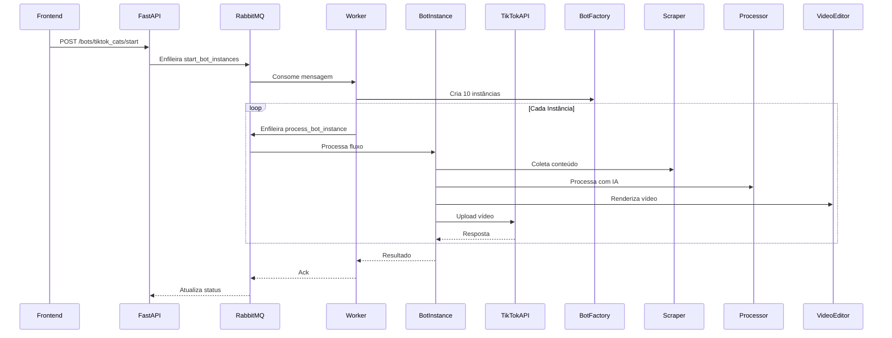

### **Arquitetura Detalhada**
```
📦 backend
├── 📂 app
│   ├── 📂 api
│   │   └── 📂 endpoints
│   │       └── 📜 bots.py          # Endpoints FastAPI
│   │
│   ├── 📂 core
│   │   ├── 📂 bots                 # Lógica principal dos bots
│   │   │   ├── 📂 base             # Classes abstratas
│   │   │   │   └── 📜 bot.py       # BotBase (ABC)
│   │   │   │
│   │   │   ├── 📂 factories        # Factory Pattern
│   │   │   │   └── 📜 bot_factory.py
│   │   │   │
│   │   │   ├── 📂 strategies       # Strategy Pattern
│   │   │   │   ├── 📜 scraping_strategy.py
│   │   │   │   ├── 📜 processing_strategy.py
│   │   │   │   ├── 📜 editing_strategy.py
│   │   │   │   └── 📜 upload_strategy.py
│   │   │   │
│   │   │   └── 📂 implementations  # Implementações concretas
│   │   │       └── 📂 first_bot
│   │   │           ├── 📜 bot.py   # FirstBot(BotBase)
│   │   │           └── 📜 config.py
│   │   │
│   │   └── 📂 processing           # Fluxo principal
│   │       ├── 📜 scraper.py
│   │       ├── 📜 processor.py
│   │       ├── 📜 editor.py
│   │       └── 📜 uploader.py
│   │
│   ├── 📂 models
│   │   └── 📜 schemas.py           # Modelos Pydantic
│   │
│   ├── 📂 workers
│   │   ├── 📜 tasks.py             # Tarefas Dramatiq
│   │
│   ├── 📜 main.py                  # Setup FastAPI
│   └── 📜 config.py                # Configurações
│
├── 📂 docker
│   ├── 📜 Dockerfile.api             # Configuração da API
│   └── 📜 Dockerfile.worker          # Tarefas Dramatiq
│
├── 📂 environment
│   ├── 📜 implementation.env
│   └── 📜 template.env
│
├──📜 docker-compose.yml
├──📜 .gitignore
├──📜 requirements.txt
└──📜 README.md
```

### **Fluxo de Dados Detalhado**

