### **Arquitetura Detalhada**
```
📦 backend
├── 📂 app
│   ├── 📂 api
│   │   └── 📂 endpoints
│   │       └── 📜 bots.py          # Endpoints FastAPI
│   │
│   ├── 📂 core
│   │   ├── 📂 bots                 # Lógica principal dos bots
│   │   │   ├── 📂 base             # Classes abstratas
│   │   │   │   └── 📜 bot.py       # BotBase (ABC)
│   │   │   │
│   │   │   ├── 📂 factories        # Factory Pattern
│   │   │   │   └── 📜 bot_factory.py
│   │   │   │
│   │   │   ├── 📂 strategies       # Strategy Pattern
│   │   │   │   ├── 📜 scraping_strategy.py
│   │   │   │   ├── 📜 processing_strategy.py
│   │   │   │   ├── 📜 editing_strategy.py
│   │   │   │   └── 📜 upload_strategy.py
│   │   │   │
│   │   │   └── 📂 implementations  # Implementações concretas
│   │   │       └── 📂 first_bot
│   │   │           ├── 📜 bot.py   # FirstBot(BotBase)
│   │   │           └── 📜 config.py
│   │   │
│   │   └── 📂 processing           # Fluxo principal
│   │       ├── 📜 scraper.py
│   │       ├── 📜 processor.py
│   │       ├── 📜 editor.py
│   │       └── 📜 uploader.py
│   │
│   ├── 📂 models
│   │   └── 📜 schemas.py           # Modelos Pydantic
│   │
│   ├── 📂 workers
│   │   ├── 📜 tasks.py             # Tarefas Dramatiq
│   │
│   ├── 📜 main.py                  # Setup FastAPI
│   └── 📜 config.py                # Configurações
│
├── 📂 docker
│   ├── 📜 Dockerfile.api             # Configuração da API
│   └── 📜 Dockerfile.worker          # Tarefas Dramatiq
│
├── 📂 environment
│   ├── 📜 implementation.env
│   └── 📜 template.env
│
├──📜 docker-compose.yml
├──📜 .gitignore
├──📜 requirements.txt
└──📜 README.md
```

### **Fluxo de Dados Detalhado**

```mermaid
sequenceDiagram
    participant Frontend
    participant FastAPI
    participant RabbitMQ
    participant Worker
    participant BotInstance
    participant TikTokAPI

    Frontend->>FastAPI: POST /bots/tiktok_cats/start
    FastAPI->>RabbitMQ: Enfileira start_bot_instances
    RabbitMQ->>Worker: Consome mensagem
    Worker->>BotFactory: Cria 10 instâncias
    loop Cada Instância
        Worker->>RabbitMQ: Enfileira process_bot_instance
        RabbitMQ->>BotInstance: Processa fluxo
        BotInstance->>Scraper: Coleta conteúdo
        BotInstance->>Processor: Processa com IA
        BotInstance->>VideoEditor: Renderiza vídeo
        BotInstance->>TikTokAPI: Upload vídeo
        TikTokAPI-->>BotInstance: Resposta
    end
    BotInstance-->>Worker: Resultado
    Worker-->>RabbitMQ: Ack
    RabbitMQ-->>FastAPI: Atualiza status
```

